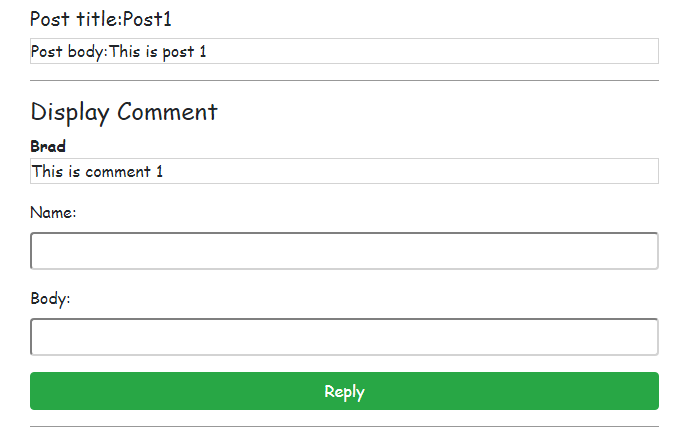

# Blog Post App

In this project I built a blog post app using Laravel 7 which basically allows visitors of the website to comment on the post specified by the admin and to reply to the comments made by others for that post.
There is a special route for the admin which can create posts and send them to the comment page and has the option to delete them. Technologies used for the project include laravel Eloquent (ORM) for the relationship between the tables, and MySQL.
For the front-end view, blade template and for building the database schema migrations were used. For building up the laravel project, Artisan Console which is a Laravel CLI was used.
Below are the snapshots of the project.
##### Comment Page
#

##### Admin page

## Instructions

* Download XAMPP or WAMP.
* Set the environment variables in .env file including the name of your desired database in the laravel project.
* run **php artisan migrate**.
* run **php artisan serve**.
##### You can now access the project at localhost:8000.

## Usage
This app can be used for posting topics and commenting on them.

## Tests
This app was tested manually.

## Future
More laravel features such as using laravel authentication for the users to login will be included.